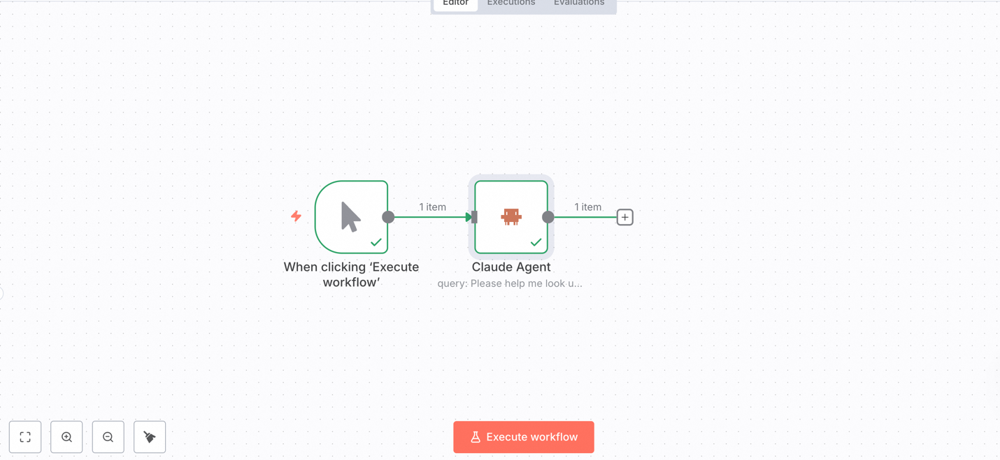
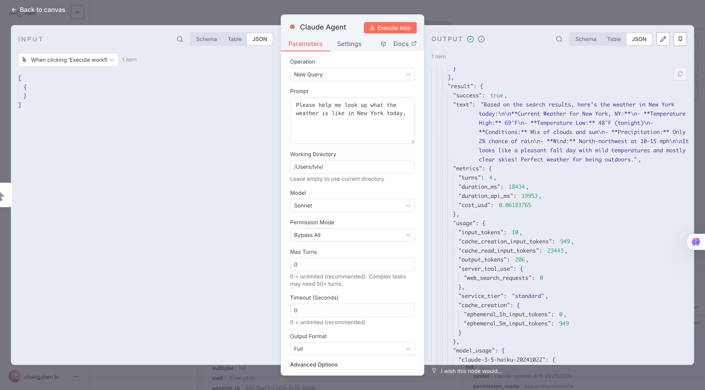

# n8n Claude Agent 节点

n8n 社区节点，集成 Claude Agent SDK，让 Claude AI 成为你自动化工作流的一部分。

[](https://www.npmjs.com/package/@lvlv-feifei/n8n-nodes-claudeagent)
[](https://opensource.org/licenses/MIT)

---

## 💡 订阅说明

**本节点适用于 Claude Pro 或 API 订阅用户**

- ✅ 使用本地 Claude Code 登录状态，无需额外配置 API Key
- ✅ 不会额外产生 API 费用，计入你的订阅计划额度内
- ✅ 支持所有 Claude 模型：Sonnet 4.5、Opus、Haiku

---

## 📸 节点展示

### n8n 工作流界面
<p align="center">
  
</p>

### 节点配置面板
<p align="center">
  
</p>

---

## 📦 安装方式

### 前提条件
- 已安装 [Claude Code](https://claude.ai/code) 并完成登录
- n8n 版本 >= 0.200.0
- Node.js >= 20.15

### 方法 1：npm 远程安装（推荐）
```bash
cd ~/.n8n/nodes
npm install @lvlv-feifei/n8n-nodes-claudeagent
```

### 方法 2：本地开发安装
```bash
git clone https://github.com/lvlv-feifei/n8n-nodes-claudeagent.git
cd n8n-nodes-claudeagent
npm run install-local
```

安装完成后重启 n8n，在节点列表中搜索 "Claude Agent"。

---

## 🚀 快速开始

1. **添加节点**
   在 n8n 工作流中搜索 "Claude Agent" → 拖拽到画布

2. **配置并运行**
   选择操作类型 → 输入 Prompt → 执行工作流

---

## 🎯 节点能力

### 会话操作

| 操作 | 说明 | 典型场景 |
|------|------|----------|
| **New Query** | 启动新对话 | 独立任务、代码生成 |
| **Continue** | 继续最近会话 | 多轮对话、迭代优化 |
| **Resume** | 恢复指定会话 | 回到历史节点继续 |
| **Fork** | 分叉会话 | 从某个点尝试不同方案 |

### 常用参数

| 参数 | 类型 | 默认值 | 说明 |
|------|------|--------|------|
| `prompt` | string | - | **必填** 发送给 Claude 的指令 |
| `model` | select | `sonnet` | 模型选择：Sonnet 4.5 / Opus / Haiku |
| `projectPath` | string | - | 工作目录路径（相对或绝对） |
| `outputFormat` | select | `summary` | 输出格式：Summary / Full / Text Only |
| `maxTurns` | number | 25 | 最大对话轮数 |
| `timeout` | number | 300 | 超时时间（秒） |

### 高阶参数

| 参数 | 类型 | 说明 |
|------|------|------|
| `systemPromptMode` | select | 系统提示模式：Default / Append / Custom |
| `systemPrompt` | string | 自定义系统提示词 |
| `allowedTools` | array | 工具白名单（优先级高） |
| `disallowedTools` | array | 工具黑名单 |
| `permissionMode` | select | 权限模式：Bypass All / Accept Edits / Ask Always / Plan Mode |
| `additionalDirectories` | array | 额外的目录访问权限 |
| `fallbackModel` | select | 主模型过载时的备用模型 |
| `maxThinkingTokens` | number | 扩展思考的 token 上限 |

### 可控制的工具

| 工具 | 功能 | 风险级别 |
|------|------|----------|
| `Bash` | 执行终端命令 | 🔴 高 |
| `Edit` | 编辑文件内容 | 🟠 中 |
| `Write` | 写入新文件 | 🟠 中 |
| `Read` | 读取文件 | 🟢 低 |
| `Glob` | 文件模式匹配 | 🟢 低 |
| `Grep` | 搜索文件内容 | 🟢 低 |
| `Task` | 启动子代理任务 | 🟠 中 |
| `TodoWrite` | 管理任务列表 | 🟢 低 |
| `WebFetch` | 获取网页内容 | 🟢 低 |
| `WebSearch` | 网页搜索 | 🟢 低 |

> **安全提示**：生产环境建议使用 `allowedTools` 限制高风险工具（Bash、Edit、Write）

---

## 📚 Claude Code 示例工作流

查看 `examples/` 目录获取更多实际工作流案例

> 🚧 示例库持续更新中...

---

## 🔗 相关链接

- [n8n 官网](https://n8n.io/)
- [Claude Agent SDK](https://www.npmjs.com/package/@anthropic-ai/claude-agent-sdk)
- [Anthropic](https://www.anthropic.com/)
- [问题反馈](https://github.com/lvlv-feifei/n8n-nodes-claudeagent/issues)

---

## 📄 开源协议

MIT License © 2025 lvlv-feifei

Made with ❤️ using Claude Agent SDK
